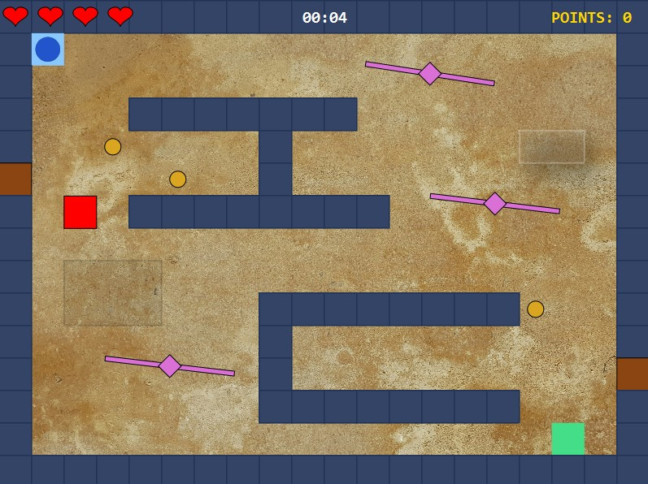
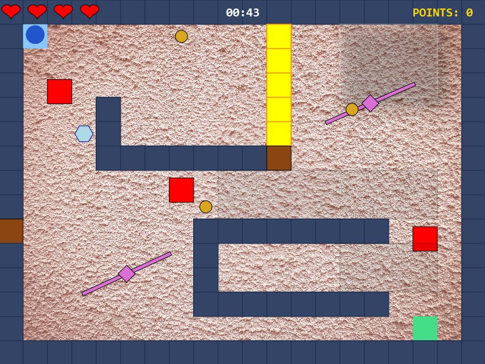
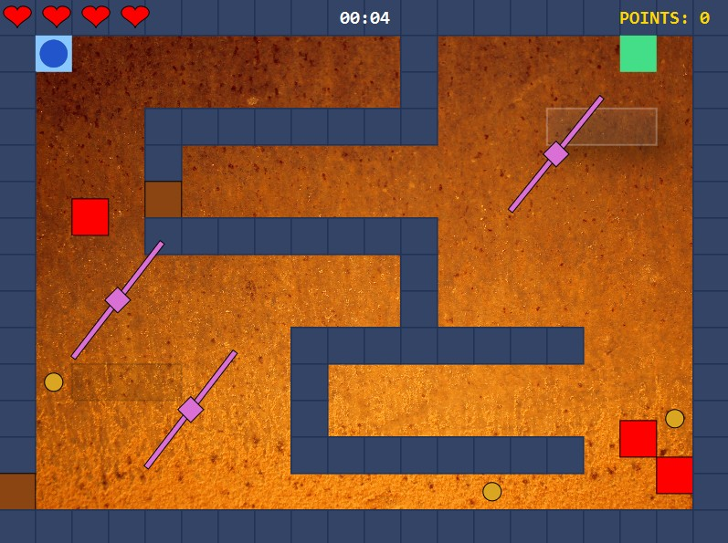
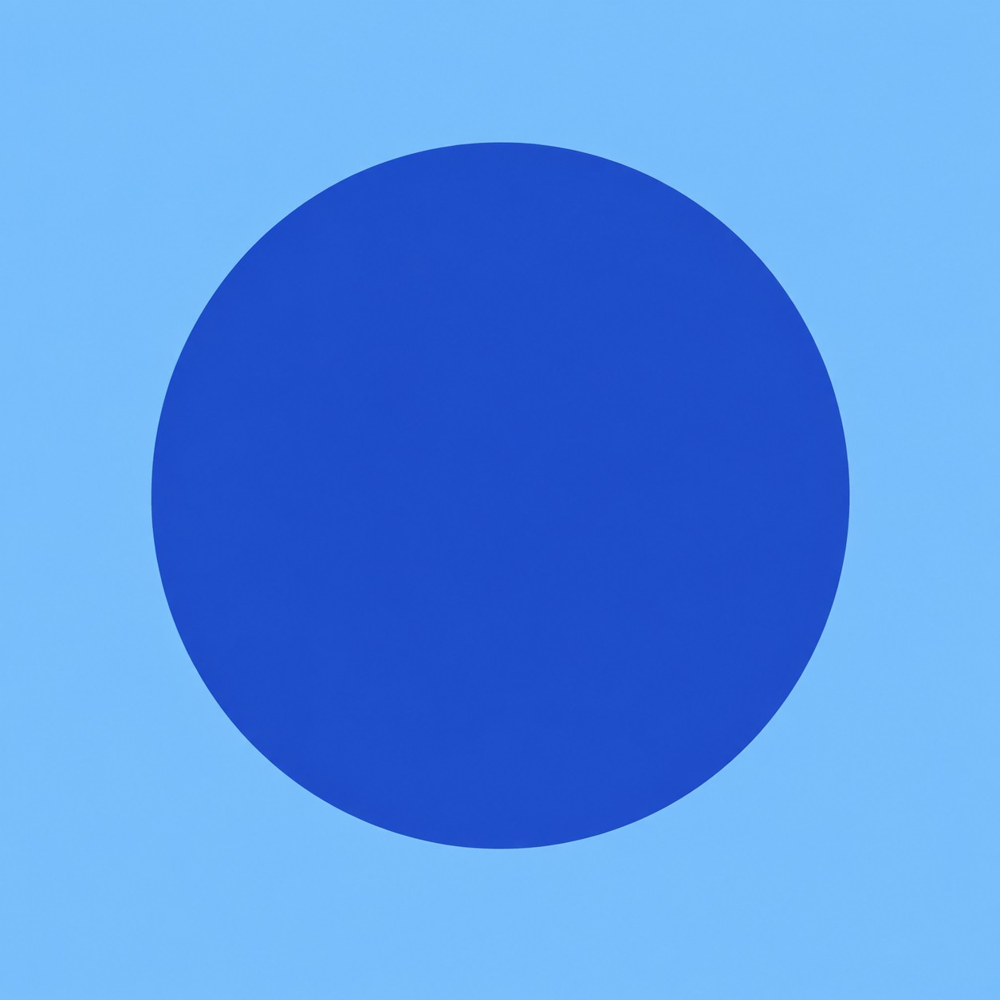
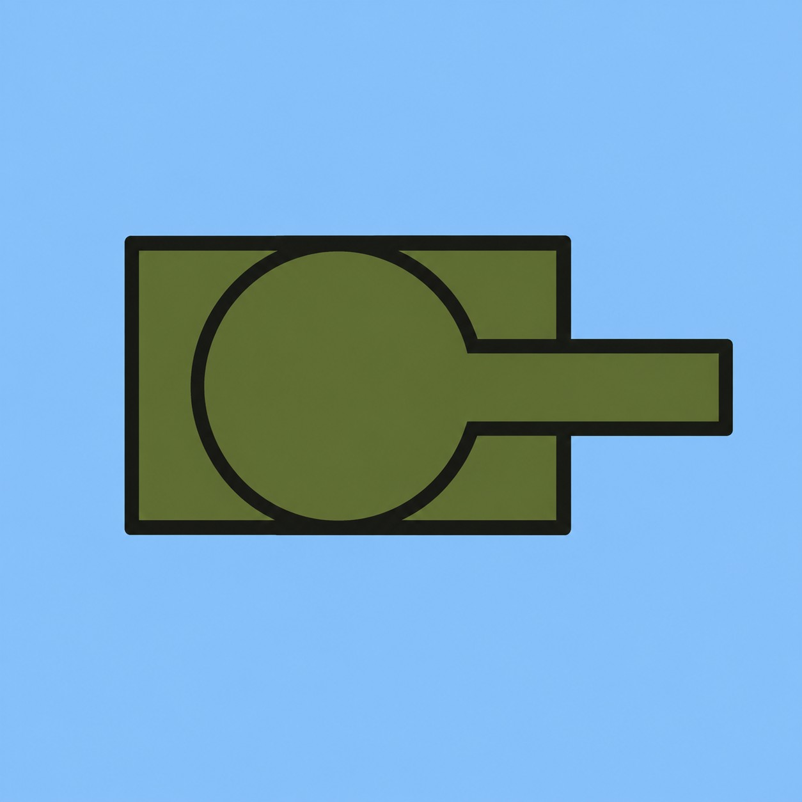

# 🎮 To The Goal

A single-player 2D game developed in **Java and JavaFX**, focused on movement, collision detection, dynamic obstacles, power-ups and multiple level configurations.

<p align="center">
  
</p>

The goal is to navigate through the map, avoid enemies and obstacles, collect coins and power-ups, and safely reach the finish point.

---

## 🎥 Gameplay

Players choose one of three characters and one of several maps before starting the game.

Each character has different movement speed and health, while every map introduces a different layout and placement of enemies and obstacles.

The player must reach the green goal while avoiding hazards and collecting useful items along the way.

---

## 🚀 Quick Start

A pre-built version of the game is available in the
[latest GitHub Release](https://github.com/minaOstojic1000/2D-game-To-The-Goal/releases/latest).

### Requirements

- **Java 17 or later** must be installed.
- The `java` command must be available from the system terminal.

You can verify your Java installation with:

```bash
java -version
```

Download `ToTheGoal.jar` from the latest release, open a terminal in the directory containing the file, and run:

```bash
java -jar ToTheGoal.jar
```

## ✨ Features

- Three selectable player types with different **movement speeds and health points**
- Multiple maps with different wall layouts, enemies and obstacle configurations
- Player movement using keyboard controls
- Collision detection with walls, enemies and moving obstacles
- Rotating obstacles
- Collectible coins and scoring
- Randomly appearing health pickups
- Temporary shield power-up
- Speed-up and slow-down terrain areas
- Cannon walls that periodically fire projectiles
- Timer, score and remaining-health display
- Automatic return to the starting position after losing a life

---

## 🗺️ Maps

The game contains several maps with different layouts and gameplay challenges.

<p align="center">
  
  
</p>

<p align="center">
  
  
</p>

---

## 🧍 Player Types

Before starting the game, the player can choose between three characters.

The characters differ in their movement speed and number of health points, creating a trade-off between mobility and durability.

<p align="center">
  
  &nbsp;&nbsp;&nbsp;
  
  &nbsp;&nbsp;&nbsp;
  
</p>

---

## ⚙️ Implementation Highlights

Some of the main game systems implemented in the project include:

- Real-time player movement
- Collision detection between the player and game objects
- Animated rotating obstacles
- Timed and randomly spawned power-ups
- Temporary player-state effects such as shields and movement-speed changes
- Projectile-based hazards
- Multiple configurable game maps
- Game-state tracking for health, score and elapsed time

---

## 🛠️ Technologies

- **Java 17**
- **JavaFX 21.0.6**
- **Maven**

---

## ▶️ Running from Source

### Requirements

- JDK 17 or later
- If you run the game using the Maven Wrapper command below, make sure the `JAVA_HOME` environment variable is defined and points to the root directory of your installed JDK (for example, `C:\Program Files\Java\jdk-17`), not to its `bin` directory.

### Using Maven Wrapper

On Windows:

```bash
.\mvnw.cmd clean javafx:run
```

On Linux/macOS:

```bash
./mvnw clean javafx:run
```

Alternatively, the project can be opened and run directly from an IDE with JavaFX support.

---

## 🎓 Project Context

This project was developed as part of the **Computer Graphics** course at the **School of Electrical Engineering, University of Belgrade**.

The assignment focused on the development of a 2D single-player game using JavaFX and the implementation of interactive 2D graphics, animation and collision-based game mechanics.

---

## 👤 Author

**Mina Ostojić**

GitHub: [@minaOstojic1000](https://github.com/minaOstojic1000)
